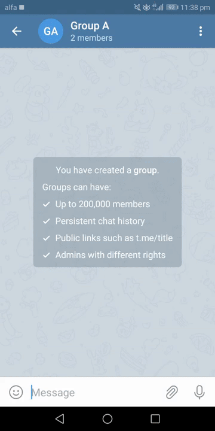
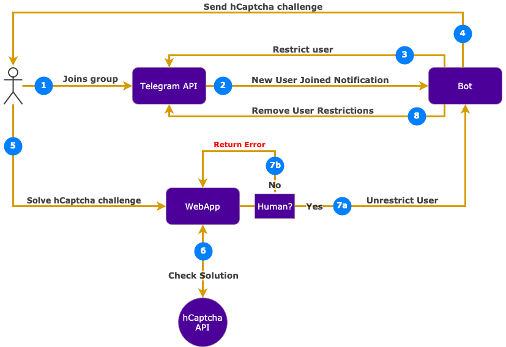

# telegram-hcaptcha-bot

## Workflow



## Screenshots

| Landing page  | Verified | Failed to verify  |
|:-------------:|:-------------:|:-----:|
|   |  |  |

## How everything is connected



## Setup:

1. Create your telegram bot (please check section below).
1. Signup to [hCaptcha](https://dashboard.hcaptcha.com/signup) to get your site key and secret (please check section below) .
1. Install dependencies: `pipenv install --dev` (make sure to have [`pipenv`](https://docs.pipenv.org/en/latest/install/) installed).
1. Copy `.env.sample` to `.env` and add: `TELEGRAM_USERNAME`, `TELEGRAM_TOKEN`, `HCAPTCHA_SECRET` and `HCAPTCHA_SITE_KEY`.


### Where to get `HCAPTCHA_SECRET` & `HCAPTCHA_SITE_KEY`

1. Signup to [hCaptcha](https://dashboard.hcaptcha.com/signup).
1. To get `HCAPTCHA_SECRET`: go the [Settings tab](https://dashboard.hcaptcha.com/settings).
1. To get `HCAPTCHA_SITE_KEY`: go to [Sites tab](https://dashboard.hcaptcha.com/sites) and create a new site key.

### Run application locally

```shell
cd app && FLASK_APP=wsgi.py FLASK_DEBUG=1 python3 -m flask run
```

### Running the app inside docker container:

```bash
# start
docker-compose up

# stop
docker-compose down
```

### Run on heroku

Incase you need to run your the application on heroku:

1. `heroku create <dev_instance_name> --remote development`
1. Add `APP_URL` with your dev instance link

### Signup for a new Telegram bot

1. Create a new bot on telegram and note the `secret token` and the bot `username`: [Creating a new bot - Telegram documentation](https://core.telegram.org/bots#creating-a-new-bot)
1. Create a new account on [hCaptcha](https://www.hcaptcha.com/) and note the `sitekey` and the `secret token`
1. Invite the bot to your Telegram channel and set it as admin

### How to deploy

- Check the "Setup" section above and make sure that tests passes locally.

- Make sure you've already remote tracking for your target env: `git remote add <env> https://git.heroku.com/<app>.git`

- deploy changes: `git push <env> your_dev_branch:master`

- run migrations: `heroku run "python manage.py db upgrade -d app/migrations/" --remote <env>`

### Run tests

1. `pipenv run python -m pytest`
1. With coverage:
  1. `pipenv run coverage run --include="app/*" -m pytest`
  1. Show report: `pipenv run coverage report -m` or as html: `pipenv run coverage html && open htmlcov/index.html`
1. Run single test method: e.g. `python -m pytest app/tests/test_bot.py -k 'test_is_verified'`
1. Rung single test with `ipdb` breakpoint: `python -m pytest -s app/tests/bot_handlers/test_handle_invitation.py`

### Troubleshooting

- Check logs on heroku: `heroku logs --tail --remote <env>`
- The bot must be in a supergroup and the bot must be have admin permissions.
